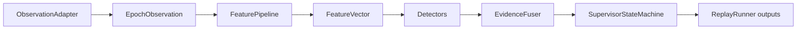
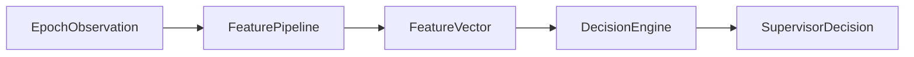

# PNT Supervisor Architecture

## Purpose

The `pnt-supervisor` package supports offline replay and PNT validity/supervision research. It provides a structured way to ingest navigation observations, normalize them into shared data models, derive deterministic features, evaluate anomaly evidence, stabilize supervisory state over time, and write replay artifacts for analysis.

The package is intentionally split into small layers so new input formats, feature extractors, detectors, fusers, state policies, and output columns can evolve independently. This makes replay experiments repeatable while keeping the per-epoch data that drove each decision available for tests, dashboards, and post-run investigation.

There are two supervisor paths in the package. The main offline replay path is the full detector/fuser/state-machine path driven by `ReplayRunner`. The lightweight rule-based path uses `DecisionEngine` and `SupervisorPipeline` for direct per-epoch decisions and should not be confused with the full replay evaluation pipeline.

## Core data model

- `EpochObservation` is the normalized per-epoch navigation record. Adapters and parsers convert source-specific logs into this shape so downstream code can operate on consistent fields such as time, position, velocity, fix quality, accuracy estimates, sentence/checksum status, and optional sensor or estimator values.
- `FeatureVector` contains deterministic derived values, boolean flags, and metadata produced from an `EpochObservation`. It is the shared feature container consumed by detectors, rule-based decisions, logging, and tests.
- `DetectorResult` is the output from one detector. It carries the detector name, an anomaly or integrity score, hard-fail status, reason codes, and detector-specific metrics that can later be fused and written to replay output.
- `SupervisorDecision` is a final supervisory decision for one epoch. It contains the navigation state, a bounded navigation score, reasons that explain the decision, and whether a hard-fail condition is active.

## Main offline replay path

The main offline replay path is the full evaluation pipeline. It is designed for replaying logs, running detector experiments, evaluating fused evidence, applying temporal state stabilization, and producing files that can be inspected after the run.

- Adapters normalize logs from input formats into `EpochObservation` records. This keeps source-specific parsing and field mapping separate from the supervision logic.
- `FeaturePipeline` extracts deterministic features from each observation. Feature extraction should be repeatable and should not make final supervision decisions by itself.
- Detectors score evidence from the observation and feature vector. Each detector emits a `DetectorResult` with scores, reason codes, hard-fail signals, and metrics.
- `EvidenceFuser` combines detector outputs into fused evidence that represents the aggregate confidence, hard-fail state, and explanatory reasons for the epoch.
- `SupervisorStateMachine` stabilizes navigation state over time so the replay result is not only a raw per-epoch score but also a temporally consistent supervisory state sequence.
- `ReplayRunner` writes replay outputs, including epoch rows, transition events, and summary data for offline evaluation.

## Lightweight rule-based path

The lightweight rule-based path is simpler than the replay path. It is useful for unit tests, lightweight rule-based decisions, direct per-epoch inspection, and API users that want a compact `EpochObservation` to `SupervisorDecision` flow.

This path does not replace the full replay detector/fuser/state-machine path. `DecisionEngine` and `SupervisorPipeline` operate directly on feature flags and values; they do not run the detector set, evidence fusion, replay state machine, transition-event writer, or replay summary writer.

## Quadcopter hover handling

Near-zero displacement makes course/track mismatch geometrically ambiguous because a meaningful track bearing cannot be inferred when the vehicle barely moves. For fixed-wing or unknown platforms, that low-motion condition may be suspicious because forward motion is generally expected. For quadcopter and other multirotor platforms, however, hover can be a valid operating mode.

`PlatformConfig.quadcopter()` sets `allow_hover=True`, allowing feature extraction to mark hover as valid instead of suspicious for hover-capable platforms. `DecisionEngine` then exempts `track_geometry_ambiguous` when `hover_valid=True`, so a valid quadcopter hover does not become degraded only because course/track geometry is ambiguous.

## ReplayRunner responsibilities

`ReplayRunner` is the full offline evaluation orchestrator. It consumes observations from an adapter, uses `FeaturePipeline` to compute features, runs detectors, fuses detector evidence, advances the supervisor state machine, and writes replay artifacts.

Its outputs are intended for offline analysis and regression checks. The runner writes epoch rows for per-epoch inspection, transition events when supervisory state changes, and a summary that captures aggregate replay results.

## Extension points

### Add new input source

Implement `ObservationAdapter` for the new source and have it yield normalized `EpochObservation` records. Keep source-specific parsing, column mapping, unit conversion, and default handling inside the adapter or parser layer.

### Add new feature

Implement a `FeatureExtractor` and add it to the `FeaturePipeline` or the appropriate pipeline factory. Features should be deterministic and should write reusable values, flags, or metadata into `FeatureVector`.

### Add new detector

Implement a detector-like `evaluate()` method that accepts the observation, feature vector, and configuration, then returns a `DetectorResult`. Add the detector to the replay factory so `ReplayRunner` includes it in the full offline path.

### Add new output column

Update `replay_epoch_row.py` to emit the new column and add or update tests that verify the column value. Prefer deriving output columns from already-recorded observations, features, detector results, fused evidence, or state-machine outputs.

### Add GUI/plot metric

Consume existing epoch output columns for GUI or plotting metrics when possible. If a new metric is needed, add it to replay epoch output first so downstream visualization code reads a stable, replay-generated column rather than recomputing supervision internals.
